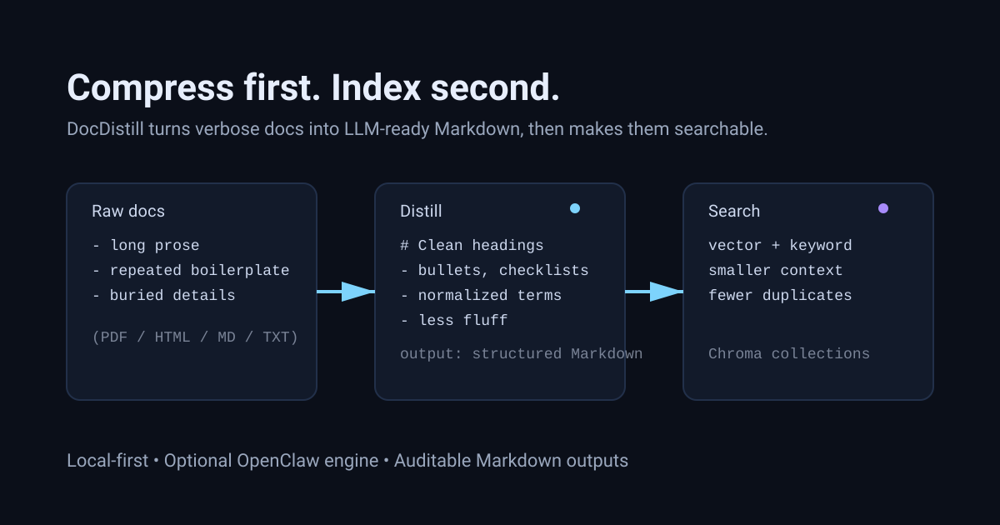
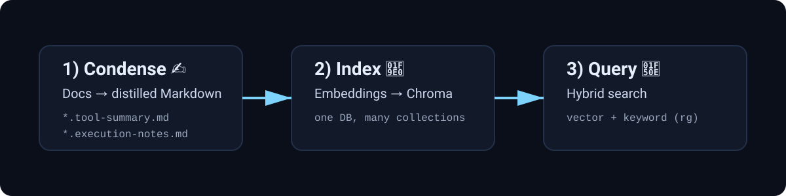

# DocDistill

<p align="center">
  
</p>

DocDistill is a local-first CLI that turns a folder of docs (PDF/HTML/TXT/MD) into **low-fluff, LLM-ready Markdown** — and can then **index + query** the distilled output.

Core idea: **compression-before-embeddings** ✂️➡️🧠

<p align="center">
  
</p>

## What you get

For each input file:
- `*.execution-notes.md` — practical run/operate notes (checks, failure modes, commands)
- `*.tool-summary.md` — compact index entry (purpose, capabilities, entrypoints, footguns)

Optionally:
- `docdistill index` stores embeddings in **Chroma** 🧠 (one DB, many collections)
- `docdistill query` runs **hybrid search** 🔎 (vector + keyword)

## Why local + open-source?

If you want a private, local setup (no managed “fancy vector DB” required), DocDistill keeps everything on your machine:
- Distilled Markdown artifacts are plain files you can audit + version control
- Indexing uses **Chroma** (open-source, local) and keyword search uses **ripgrep**
- You can still swap in a hosted vector DB later if you outgrow local

## Engines

DocDistill supports two backends:

- **OpenClaw (recommended):** uses your local OpenClaw Gateway `/v1/responses` endpoint for higher-quality, format-following condensation.
- **Ollama:** uses `POST /api/generate` for fully local inference (often less reliable at strict templates).

## Prereqs

- **Python 3.11+**
- An LLM engine:
  - **OpenClaw** (recommended) 🪐, or
  - **Ollama** 🦙
- For search:
  - **Chroma** (open-source, local) 🧠 at `http://127.0.0.1:8100`

## Install

```bash
# from repo root
python3 -m venv .venv
source .venv/bin/activate
pip install -r docdistill/requirements.txt
```

## Quickstart (60s)

```bash
# 1) Distill
python -m docdistill.docdistill_cli condense /path/to/docs --out ./docdistill_out --engine ollama --ollama-model llama3.2:3b

# 2) Index (requires Chroma running)
python -m docdistill.docdistill_cli index ./docdistill_out --collection my-docs --chroma-url http://127.0.0.1:8100

# 3) Query
python -m docdistill.docdistill_cli query ./docdistill_out --collection my-docs "rollback procedure"
```

## Usage

### 1) Distill docs ✍️

```bash
python -m docdistill.docdistill_cli condense /path/to/docs \
  --out ./docdistill_out \
  --engine openclaw
```

(Or fully local: `--engine ollama --ollama-model llama3.2:3b`.)

### 2) Index distilled output (Chroma)

```bash
python -m docdistill.docdistill_cli index ./docdistill_out \
  --collection my-docs \
  --chroma-url http://127.0.0.1:8100
```

### 3) Query (hybrid)

```bash
python -m docdistill.docdistill_cli query ./docdistill_out \
  --collection my-docs \
  --top-k 5 \
  --keyword-top-k 5 \
  "rollback procedure"
```

### Useful flags

- `--skip-existing` : don’t redo files that already have both outputs
- `--sleep-ms 200` : throttle between files (helps avoid timeouts)
- `--max-chars 180000` : cap extracted text per file before summarizing

## Output layout

DocDistill preserves folder structure under your `--out` dir:

```text
<out>/
  some/subdir/file.execution-notes.md
  some/subdir/file.tool-summary.md
```

## Notes / gotchas

- PDF extraction is best-effort: scanned PDFs without embedded text won’t be great.
- If you use `--engine openclaw`, pass `--gateway-token` or set `OPENCLAW_GATEWAY_TOKEN`.
- Indexing defaults to high-signal artifacts (nodes/summaries/notes) and skips `*.outline.md` unless you opt in.

## Roadmap (planned)

- **Stage-1 outline** (loss-minimized, high budget)
- **Atomic topic nodes** (200–600 token shards)
- **`index.md` graph** (tiny navigational maps)
- One-command pipeline (condense → index)

---

Built to turn “docs” into **usable, searchable tool knowledge**.
